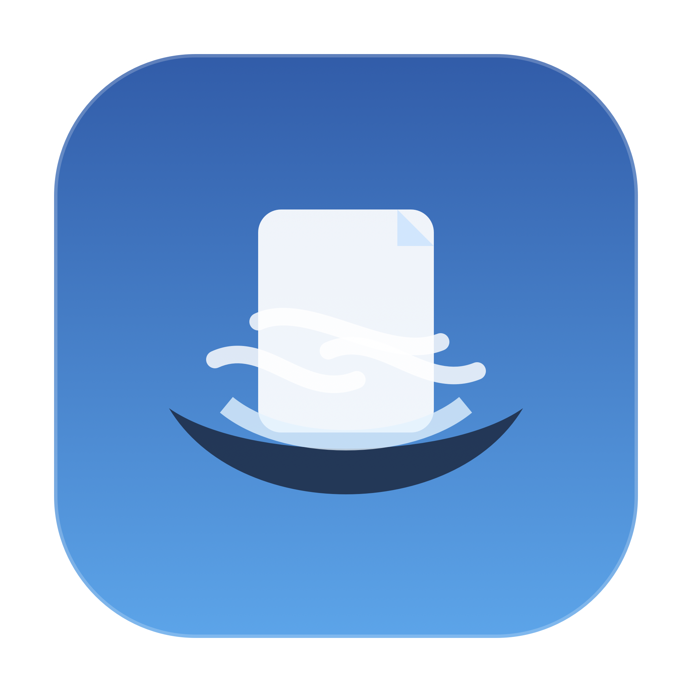

<p align="center">
  
</p>

<h1 align="center">Nest</h1>

<p align="center">
  A Finder-native AI agent for macOS.
</p>

Nest is a native macOS AI agent that lives in Finder.

Select files, tell Nest what you want, and it can understand, inspect, transform, organize, or act on them using natural language. Nest docks beneath the active Finder window, understands the current selection, talks to your chosen AI provider, and turns requests into useful local file actions.

Nest is designed to feel like a file agent beside you: quick for simple tasks, careful around risky actions, and transparent about what it is doing.

## Features

- Finder-native AI agent experience
- Natural-language understanding for selected files and folders
- Local file actions generated through bring-your-own AI providers
- Gemini, OpenRouter, OpenAI-compatible APIs, and local Ollama support
- Instant shortcuts for common file operations
- Auto-run policy for harmless commands
- Command preview for risky actions
- In-bar progress and result display
- Activity log for recent prompts, commands, outputs, and failures
- Optional extra tools such as ImageMagick
- First-run onboarding and permission health checks

## Download

Download the latest `.dmg` from the GitHub Releases page:

[Download Nest](https://github.com/HyperOrb/Nest/releases/latest)

Open the `.dmg`, drag Nest into Applications, then launch it.

If macOS warns that the app is from an unidentified developer, right-click Nest and choose **Open**.

## Permissions

Nest uses macOS Accessibility and Automation permissions so the agent can follow Finder windows and understand the selected files. macOS may ask for these permissions the first time the app runs.

## AI Providers

API keys are stored locally in:

```bash
~/.finder_ai_config.json
```

Supported providers:

- Gemini
- OpenRouter
- OpenAI-compatible APIs
- Ollama Local

## Optional Tools

Some actions use optional command-line tools:

- ImageMagick for advanced image edits
- FFmpeg/FFprobe for media conversion and inspection
- Pandoc for document conversion
- Poppler/QPDF/Ghostscript for advanced PDF actions

Nest does not install tools automatically from AI-generated commands. Extra tools are installed only when the user confirms from Settings.

## Notes

Nest is currently a standalone Swift/AppKit + SwiftUI app compiled with `swiftc`.
