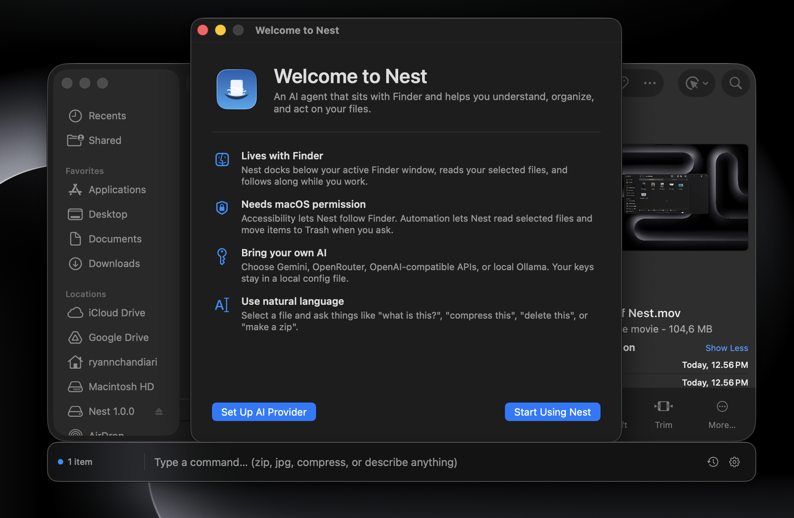
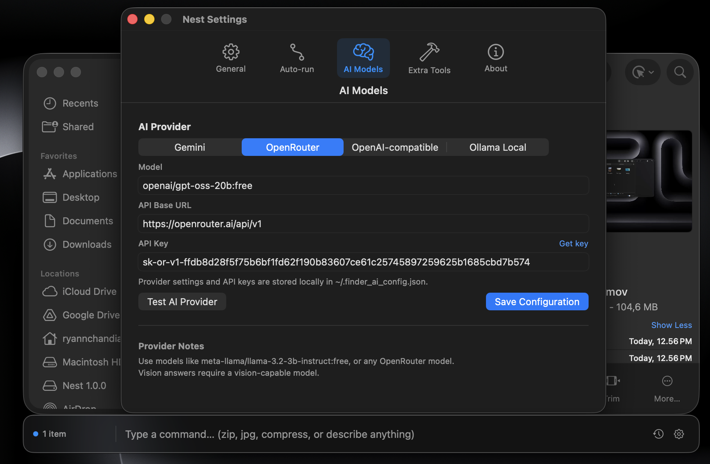
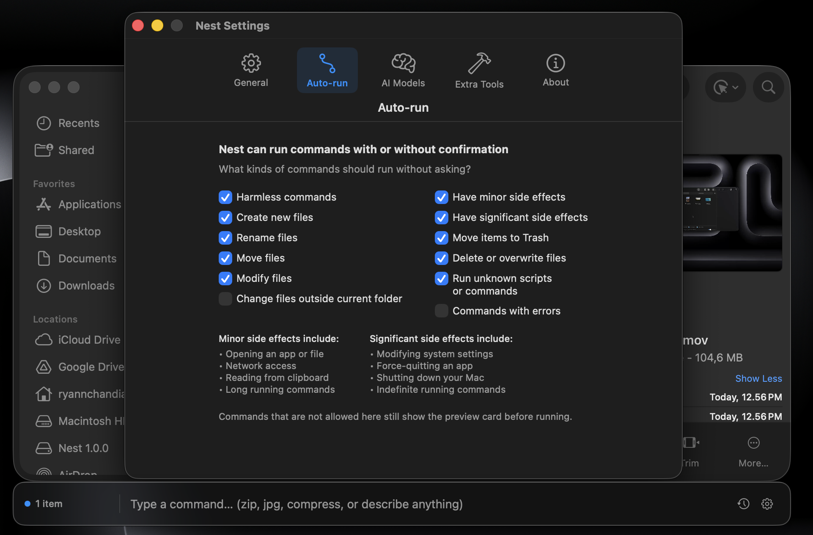
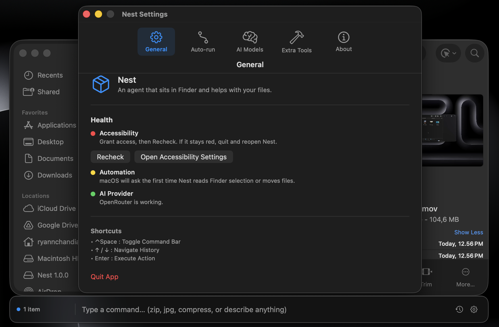
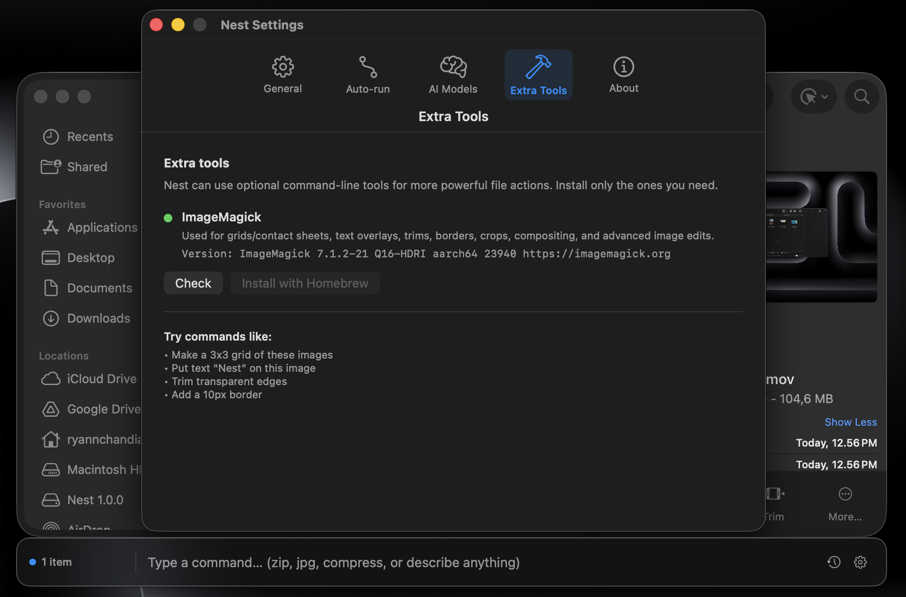

<p align="center">
  
</p>

<h1 align="center">Nest</h1>

<p align="center">
  <strong>Your Finder-native AI companion for macOS.</strong><br>
  <a href="https://youtu.be/depebDj8i74">📺 Watch the Demo Video</a>
</p>

<p align="center">
  
  
  
</p>

<hr>

### 🧠 What is Nest?

**Nest is a native macOS AI agent that lives directly inside Finder.** 

Instead of copying and pasting files into a web browser, just select files right in Finder, tell Nest what you want, and let it work. Whether you need to inspect code, transform documents, organize chaotic folders, or act on media, Nest understands your current selection using natural language.

It docks elegantly beneath the active Finder window, speaks to your chosen AI provider, and translates your requests into safe, useful local file actions.

### ✨ Features

- **🎯 Finder-Native Experience:** Docks perfectly with your active window. No context switching.
- **🗣️ Natural Language Commands:** Talk to your files in plain English.
- **🔌 Bring Your Own AI:** Plug in your API keys. Supports **Gemini, OpenRouter, OpenAI-compatible APIs**, and even **Ollama** for 100% offline local privacy.
- **⚡ Instant Shortcuts:** Pre-built instant actions for common, repetitive file operations.
- **🛡️ Safe by Design:** Harmless commands run automatically. Risky or destructive commands are presented as a preview for your explicit approval.
- **📊 Live Progress:** Real-time in-bar progress and result display.
- **📜 Activity Log:** Keep track of recent prompts, generated commands, and terminal outputs.
- **🛠️ Extensible:** Supports optional CLI tools like `ImageMagick`, `FFmpeg`, `Pandoc`, and `Poppler` for advanced transformations.

---

## 📸 See it in Action

<p align="center">
  
  
  <br><br>
  
  
  <br><br>
  
</p>

---

## 🚀 Getting Started

### Download
Grab the latest `.dmg` from the GitHub Releases page:

👉 **[Download Nest Now](https://github.com/HyperOrb/Nest/releases/latest)**

1. Open the `.dmg` and drag **Nest** into your `Applications` folder.
2. Launch Nest. *(If macOS warns about an unidentified developer, right-click Nest and select **Open**).*

### Permissions
Nest acts as your hands and eyes in the file system. It requires macOS **Accessibility** and **Automation** permissions to follow Finder windows and understand selected files. macOS will prompt you for these on the first run.

---

## ⚙️ Configuration

### AI Providers
Nest is completely BYOK (Bring Your Key). API keys are stored securely and locally on your machine at:
```bash
~/.finder_ai_config.json
```

### Optional Tools
Nest can leverage powerful open-source tools if you have them installed. It will never install them automatically without your permission.
- **ImageMagick:** For advanced image manipulation.
- **FFmpeg/FFprobe:** For video/audio conversion and inspection.
- **Pandoc:** For document conversion (Markdown, Word, PDF).
- **Poppler / QPDF:** For advanced PDF wizardry.

---

<p align="center">
  <i>Built with Swift, AppKit, and SwiftUI.</i><br>
  <b>Designed for builders who live in Finder.</b>
</p>
